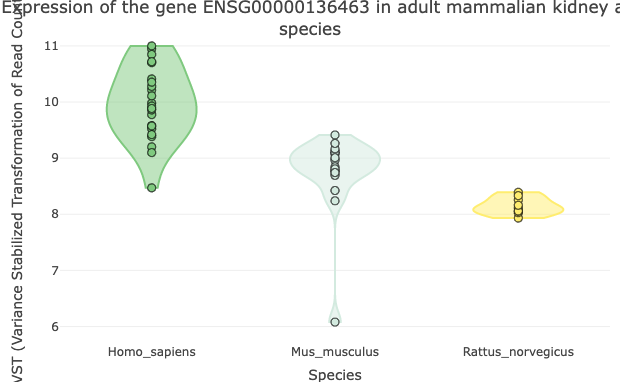

```{r, include = FALSE}
knitr::opts_chunk$set(
    collapse = TRUE,
    comment = "#>"
)
```

------------------------------------------------------------------------

# Summary

**C**r**o**ss **S**pecies **I**nvestigation and **A**nalysis (`CoSIA`) is a package that provides researchers with an alternative methodology for comparing across species and tissues using normal wild-type RNA-Seq Gene Expression data from Bgee. Using RNA-Seq Gene Expression data, CoSIA provides multiple visualization tools to explore the transcriptome diversity and variation across genes, tissues, and species. CoSIA uses the Coefficient of Variation and Shannon Entropy and Specificity to calculate transcriptome diversity and variation. CoSIA also provides additional conversion tools and utilities to provide a streamlined methodology for cross-species comparison.


CoSIA is split into 3 methods that provide various resources in order for researchers to conduct cross species analysis using gene expression metrics.

-   Method 1 uses `getConversion` to convert inputs between different gene identifiers in the same species as well as orthologs in different species. The other modules access tissue- and/or species-specific gene expression.

-   Method 2 uses `getGEx` to obtain raw read counts that undergo Variance Stabilizing Transformation via DESeq2 methodology. Gene expression values are visualized for a single gene *across multiple tissues in single model organism* or *across multiple species in a single tissue* using the plotting methods, `plotTissueGEx` & `plotSpeciesGEx`, respectively.

-   Method 3 uses `getGExMetrics` to calculate median-based Coefficient of Variation (variability) and Shannon Entropy (diversity & specificity). There are two accompanying plotting methods, `plotCVGEx` & `plotDSGEx` that are used to visualize the variation and diversity & specificity (DS) of gene expression across genes, tissues, and species.

------------------------------------------------------------------------

## Installation

In R:

```{r, eval=FALSE}
if (!require("BiocManager", quietly = TRUE))
    install.packages("BiocManager")

BiocManager::install("CoSIA")
```

## Generating a CoSIAn object

### Load CoSIA

```{r setup, warning=FALSE, message=FALSE}
library(CoSIA)
load("../inst/extdata/proccessed/monogenic_kidney_genes.rda")


# downsampling data for figure
set.seed(42)
monogenic_kid_sample <- dplyr::sample_n(monogenic_kidney_genes, 50)

```

### Arguments and options table

+-----------------------------------+------------------------------------------------------------------------------------+---------------+
| Slot Name                         | Possible Value Options                                                             | Default       |
+:=================================:+:==================================================================================:+:=============:+
| gene_set                          | "character", c(characters), data.frame\$column                                     | N/A           |
+-----------------------------------+------------------------------------------------------------------------------------+---------------+
| i_species; o_species; map_species | "h_sapiens", "m_musculus", "r_noregicus", "d_rerio", "d_melangoaster", "c_elegans" | N/A           |
+-----------------------------------+------------------------------------------------------------------------------------+---------------+
| mapping_tool                      | "annotationDBI", "biomaRt"                                                         | annotationDBI |
+-----------------------------------+------------------------------------------------------------------------------------+---------------+
| input_id; output_ids              | "Ensembl_id", "Entrez_id", "Symbol"                                                | N/A           |
+-----------------------------------+------------------------------------------------------------------------------------+---------------+
| ortholog_database                 | "NCBIOrtho", "HomoloGene"                                                          | HomoloGene    |
+-----------------------------------+------------------------------------------------------------------------------------+---------------+
| map_tissue                        | c("tissue"), "tissue"; see `getTissues`                                            | N/A           |
+-----------------------------------+------------------------------------------------------------------------------------+---------------+
| metric_type                       | "CV_Tissue", "CV_Species", "DS_Gene", "DS_Gene_all", "DS_Tissue", "DS_Tissue_all"  | N/A           |
+-----------------------------------+------------------------------------------------------------------------------------+---------------+

: (#tab:Table1.) CoSIA Arguments and Options.

### Find possible tissues with `getTissues`

The function `getTissues` retrieves tissues available for a single species:

```{r getTissues_1, warning=FALSE, message=FALSE, eval=FALSE}
CoSIA::getTissues("d_rerio")
```

...or tissues shared across a list of species:

```{r getTissues_2, warning=FALSE, message=FALSE}
CoSIA::getTissues(c("h_sapiens", "m_musculus", "r_norvegicus"))
```

*NOTE*: To compare across all shared tissues for your selected species, you can assign the `getTissues` output to an object as input for `map_tissues` when initializing a CoSIAn object.

### Initializing a CoSIAn object

```{r CoSIAnObj}
CoSIAn_Obj <- CoSIA::CoSIAn(
    gene_set = unique(monogenic_kid_sample$Gene),
    i_species = "h_sapiens",
    o_species = c(
        "h_sapiens",
        "m_musculus",
        "r_norvegicus"
    ),
    input_id = "Symbol",
    output_ids = "Ensembl_id",
    map_species = c(
        "h_sapiens",
        "m_musculus",
        "r_norvegicus"
    ),
    map_tissues = c(
        "adult mammalian kidney",
        "heart"
    ),
    mapping_tool = "annotationDBI",
    ortholog_database = "HomoloGene",
    metric_type = "CV_Species"
)

str(CoSIAn_Obj)
```

*NOTE*: Any species you plan to compare must be specified in `map_species` AND `o_species`.

*NOTE*: The `getGEx` function requires that "Ensembl_id" is included as an `output_id`. Here, we convert gene symbols into Ensembl IDs.

## Use Cases with Monogenic Kidney Disease-Associated Genes

The following use cases provide running examples of CoSIA applications with [Natera's Monogenic Kidney Disease Panel](https://www.natera.com/resource-library/renasight/385-genes-associated-with-monogenic-disorders-linked-to-kidney-disease). We will perform id conversion, obtain and visualize gene expression data, and calculate and visualize CV and DS of gene expression across three species (human, mouse, & rat) and two tissues (kidney & heart).

### Use Case #1: Converting Gene Symbols to Ensembl IDs (`getConversion`)

CoSIA can convert input ids to any of the types listed in Table \@ref(tab:Table1.).

```{r use1,  message=FALSE, warning=FALSE}
CoSIAn_Obj_convert <- CoSIA::getConversion(CoSIAn_Obj)

CoSIA::viewConvertId(CoSIAn_Obj_convert)
```

------------------------------------------------------------------------

### Use Case #2: Obtaining and visualizing curated non-diseased kidney and heart gene expression data for human, mouse, rat from Bgee

Now we will use the converted IDs with `getGEx` to obtain heart and kidney gene expression data for human, mouse and rat curated from Bgee.

```{r use2_1,  message=FALSE, warning=FALSE}
CoSIAn_Obj_gex <- CoSIA::getGEx(CoSIAn_Obj_convert)

CoSIA::viewGEx(CoSIAn_Obj_gex)
```

These data can be visualized with `plotSpeciesGEx` to plot expression of a single gene in a single tissue across species or `plotTissueGEx` to plot expression of a single gene in a single species across tissues.

Here we are plotting gene expression for the [TACO1](https://www.proteinatlas.org/ENSG00000136463-TACO1) gene in kidney tissue for human, mouse, and rat.

```{r plotSpeciesGEx, fig.small=TRUE, fig.cap = "Gene Expression of TACO1 in Kidney Across Species", message=FALSE, warning=FALSE, eval=FALSE}
CoSIAn_Obj_gexplot <- CoSIA::plotSpeciesGEx(CoSIAn_Obj_gex, "adult mammalian kidney", "ENSG00000136463")

CoSIAn_Obj_gexplot
```


CoSIA produces an interactive plot of expression values for TACO1 in kidney for human mouse and rat. Hovering over the plot displays sample-specific VST read count values. For file size compliance, we have included a static plot for this output. 
*NOTE:* Expression values are not meant to be compared across species in this plot. The next two use cases demonstrate appropriate methods for comparing gene expression patterns across species.

------------------------------------------------------------------------

### Use Case #3: Gene expression variability across species for kidney tissue by calculating and visualizing median-based Coefficient of Variation (CV)

Calculating and visualizing median-based coefficient of variation allows for a relative comparison of gene expression variability between species. In CoSIA, CV is calculated as the standard deviation over the median using VST read count values. In the section \@ref(initializing-a-cosian-object), we set `metric_type= "CV_Species"` to calculate CV for the monogenic kidney gene set across human, mouse and rat.

```{r plotCVGEx, dpi=200, fig.height=13, fig.width=6, fig.cap = "Gene Expression Variability Across Species in Kidney Tissue", fig.wide=TRUE, message=FALSE, warning=FALSE}

CoSIAn_Obj_CV <- CoSIA::CoSIAn(
    gene_set = unique(monogenic_kid_sample$Gene),
    i_species = "h_sapiens",
    o_species = c(
        "h_sapiens",
        "m_musculus",
        "r_norvegicus"
    ),
    input_id = "Symbol",
    output_ids = "Ensembl_id",
    map_species = c(
        "h_sapiens",
        "m_musculus",
        "r_norvegicus"
    ),
    map_tissues = c(
        "adult mammalian kidney",
        "heart"
    ),
    mapping_tool = "annotationDBI",
    ortholog_database = "HomoloGene",
    metric_type = "CV_Species"
)

CoSIAn_Obj_CV <- CoSIA::getConversion(CoSIAn_Obj_CV)

CoSIAn_Obj_CV <- CoSIA::getGExMetrics(CoSIAn_Obj_CV)

CoSIAn_Obj_CVplot <- CoSIA::plotCVGEx(CoSIAn_Obj_CV)

CoSIAn_Obj_CVplot
```

Here we see relatively high variability in gene expression of multiple genes in mouse relative to rat and human.`metric_type= "CV_Tissue"` displays the variability of gene expression for the monogenic gene set across selected, shared tissues.

------------------------------------------------------------------------

### Use Case #4: Gene expression diversity and specificity across tissues and species for monogenic kidney-disease associated genes

Diversity and specificity metrics are also suitable for comparing gene expression patterns across species. In CoSIA, diversity and specificity (based on Shannon's entropy) are calculated using min-max scaled median VST values generated each gene in a tissue- and species-specific manner. Values are used to calculate diversity and specificity as in [Martínez & Reyes-Valdés, 2008](https://www.pnas.org/doi/10.1073/pnas.0803479105).

In the final use case, we are calculating and visualizing diversity and specificity for kidney and heart tissue across the monogenic kidney gene set by setting `metric_type= "DS_Tissue"`. There are additional metric_types for the CoSIAn objects, view \@ref(tab:Table2.)

```{r use4, message=FALSE, warning=FALSE}
CoSIAn_Obj_DS <- CoSIA::CoSIAn(
    gene_set = unique(monogenic_kid_sample$Gene),
    i_species = "h_sapiens",
    o_species = c("h_sapiens", "m_musculus", "r_norvegicus"),
    input_id = "Symbol",
    output_ids = "Ensembl_id",
    map_species = c("h_sapiens", "m_musculus", "r_norvegicus"),
    map_tissues = c("adult mammalian kidney", "heart"),
    mapping_tool = "annotationDBI",
    ortholog_database = "HomoloGene",
    metric_type = "DS_Tissue"
)

CoSIAn_Obj_DS <- CoSIA::getConversion(CoSIAn_Obj_DS)

CoSIAn_Obj_DS <- CoSIA::getGExMetrics(CoSIAn_Obj_DS)

CoSIAn_Obj_DSplot <- CoSIA::plotDSGEx(CoSIAn_Obj_DS)

CoSIAn_Obj_DSplot
```
There is low specificity in kidney tissue, indicating there are more genes from the set that are expressed in kidney. We see higher specificity in heart tissue, indicating that there are fewer genes from the set that are expressed in heart. This pattern is seen for all three species. 

+---------------+---------------------------------------------------------------------------------------------------------------+
| Metric Type   | Function                                                                                                      |
+===============+===============================================================================================================+
| DS_Gene       | calculates diversity and specificity across genes in `gene_set` in the tissues listed in `map_tissue`         |
+---------------+---------------------------------------------------------------------------------------------------------------+
| DS_Gene_all   | calculates diversity and specificity across genes in `gene_set` in the all the available tissues in a species |
+---------------+---------------------------------------------------------------------------------------------------------------+
| DS_Tissue     | calculates diversity and specificity across tissues listed in `map_tissue` in the genes in `gene_set`         |
+---------------+---------------------------------------------------------------------------------------------------------------+
| DS_Tissue_all | calculates diversity and specificity across tissues listed in `map_tissue` in the all the genes in a species  |
+---------------+---------------------------------------------------------------------------------------------------------------+

: (#tab:Table2.) CoSIA Metric Type options.


Session info

```{r}
sessionInfo()
```
