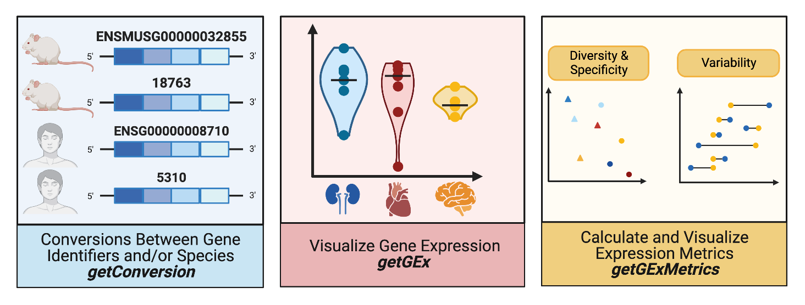

```{css, echo=FALSE}
.row {
  margin-left: -200px;
}
```


```{r, include = FALSE}
knitr::opts_chunk$set(
  collapse = TRUE,
  comment = "#>"
)
```


**** 


`CoSIA`: **C**r**o**ss **S**pecies **I**nvestigation and **A**nalysis is an R package that provides researchers with the tools to measure and visualize gene-expression metrics in order to compare across model organisms and their tissues. Specifically, CoSIA uses curated non-diseased wild-type RNA-sequencing expression data, from Bgee, to visualize a gene's expression across tissues and model organisms. CoSIA also streamlines conversions between gene identifiers among the same species and different species.



CoSIA is split into 3 modules that provide various resources in order for researchers to conduct cross species analysis using gene expression metrics.


# comment sample summary
Module 1 uses `getConversion` to convert inputs between different gene identifiers in the same species as well as orthologs in different species. The other modules access tissue and/or species specific gene expression. Module 2 uses `getGEx` to obtain raw [VST transformed] gene expression values of a single gene *across multiple tissues in single model organism* or *across multiple model organisms in a single tissue*. Plotting methods, `plotTissueGEx` & `plotSpeciesGEx`, are used to visualize gene expression values in this module. The third module uses the method `getGExMetrics` to calculate median-based Coefficient of Variation (variability) and Shannon Entropy (diversity & specificity). There are two accompanying plotting methods, `plotCVGEx` & `plotDSGEx` that are used to visualize the variation and diversity of gene expression across tissues and model organisms.


**** 

## Installation

In R: 

```{r, eval=FALSE}

#if (!requireNamespace("BiocManager", quietly=TRUE))
    #install.packages("BiocManager")
#BiocManager::install("CoSIA")

#library(devtools)
#install_github("lasseignelab/CoSIA", ref= "main")

```


## Generating a CoSIAn object

### Load CoSIA

```{r setup, warning=FALSE, message=FALSE}

library(CoSIA)
library(tidyverse)

load("~/Desktop/EH_Data.RData")
#load("../../Learning/useCoSIA/data/EH_Data.RData")
load("../inst/extdata/proccessed/monogenic_kidney_genes.rda")


```

### Arguments and options table

| Slot Name | Possible Value Options | Default |
|:---------:|:----------------------:|:-------:|
| gene_set | "character", c(characters), data.frame$column | N/A |
| i_species; o_species; map_species | h_sapiens, m_musculus, r_noregicus, d_rerio, d_melangoaster, c_elegans | N/A |
| mapping_tool | annotationDBI, biomaRt | annotationDBI |
| input_id; output_ids | Ensembl_id, Entrez_id, Symbol | N/A |
| ortholog_database | NCBIOrtho, HomoloGene | HomoloGene |
| map_tissue | c("tissue"), "tissue"; see `getTissues` | N/A |
| metric_type | CV_Tissue, CV_Species, DS_Gene, DS_Gene_all, DS_Tissue, DS_Tissue_all | N/A |

### Find possible tissues with `getTissues`

The function `getTissues` retrieves tissues available for a single species: 

```{r getTissues_1}

getTissues("d_rerio")

```

...or tissues shared across a list of species: 

```{r getTissues_2}

getTissues(c("h_sapiens", "m_musculus", "r_norvegicus"))

```

### Initiating a CoSIAn object

```{r CoSIAnObj}

CoSIAn_Obj <- CoSIA::CoSIAn(gene_set = unique(monogenic_kidney_genes$Gene),
                            i_species = "h_sapiens",
                            o_species = c("h_sapiens", "m_musculus", "r_norvegicus"),
                            input_id = "Symbol",
                            output_ids = "Ensembl_id",
                            map_species = c("h_sapiens", "m_musculus", "r_norvegicus"),
                            map_tissues = c("adult mammalian kidney", "heart"),
                            mapping_tool = "annotationDBI",
                            ortholog_database = "HomoloGene",
                            metric_type = "CV_Species"
                            )

str(CoSIAn_Obj)

```


## Use Cases with monogenic kidney disease-associated genes

The following use cases provide running examples of CoSIA applications with [Natera's Monogenic Kidney Disease Panel](https://www.natera.com/resource-library/renasight/385-genes-associated-with-monogenic-disorders-linked-to-kidney-disease). We will perform id conversion, obtain and visualize gene expression data, and calculate and visualize the variation and diversity of gene expression across three species (human, mouse, & rat) and two tissues (kidney & heart). 

### Use Case #1: Converting gene symbols to Ensembl IDs

Short statement on ids, note about requirement to convert to ensembl to access gex functionality. Note about useful warning error messages

```{r use1,  message=FALSE, warning=FALSE}

CoSIAn_Obj_convert <- CoSIA::getConversion(CoSIAn_Obj)

str(CoSIAn_Obj_convert)


```

****


### Use Case #2: Obtaining and visualizing curated non-diseased kidney and heart gene expression data for human, mouse, rat from Bgee

note about requirement to convert to ensembl to access gex functionality could also go here. Note about useful warning error messages. limitations of multi- tissue/species? Note about plot, don't compare species (maybe should do tissue plot
?)

```{r use2_1,  message=FALSE, warning=FALSE}

CoSIAn_Obj_gex <- CoSIA::getGEx(CoSIAn_Obj_convert)

str(CoSIAn_Obj_gex)

```

```{r use2_2, message=FALSE, warning=FALSE}

CoSIAn_Obj_gexplot <- CoSIA::plotSpeciesGEx(CoSIAn_Obj_gex, "adult mammalian kidney", "ENSG00000171766")

CoSIAn_Obj_gexplot

```

Here there should be words of the interpretation of the use case gene set. 

****

### Use Case #3:  Gene expression variation across species for kidney tissue by calculating and visualizing Coeffient of Variation

Here there should be words describing the metric and how it is calculated


```{r use3, message=FALSE, warning=FALSE}

CoSIAn_Obj_CV <- CoSIA::getGExMetrics(CoSIAn_Obj_gex)

CoSIAn_Obj_CVplot <- plotCVGEx(CoSIAn_Obj_CV)

CoSIAn_Obj_CVplot

```

Here there should be words of the interpretation of the use case gene set. 


****


### Use Case #4: Gene expression diversity and specificity across tissues and species for monogenic kidney-disease associated genes

Here there should be words describing the metric and how it is calculated

```{r use4, message=FALSE, warning=FALSE}

CoSIAn_Obj_DS <- CoSIA::CoSIAn(gene_set = unique(monogenic_kidney_genes$Gene),
                            i_species = "h_sapiens",
                            o_species = c("h_sapiens", "m_musculus", "r_norvegicus"),
                            input_id = "Symbol",
                            output_ids = "Ensembl_id",
                            map_species = c("h_sapiens", "m_musculus", "r_norvegicus"),
                            map_tissues = c("adult mammalian kidney", "heart"),
                            mapping_tool = "annotationDBI",
                            ortholog_database = "HomoloGene",
                            metric_type = "DS_Tissue"
                            )

CoSIAn_Obj_DS <- CoSIA::getConversion(CoSIAn_Obj_DS)

CoSIAn_Obj_DS <- CoSIA::getGExMetrics(CoSIAn_Obj_DS)

CoSIAn_Obj_DSplot <- CoSIA::plotDSGEx(CoSIAn_Obj_DS)

CoSIAn_Obj_DSplot


```

Here there should be words of the interpretation of the use case gene set. 


